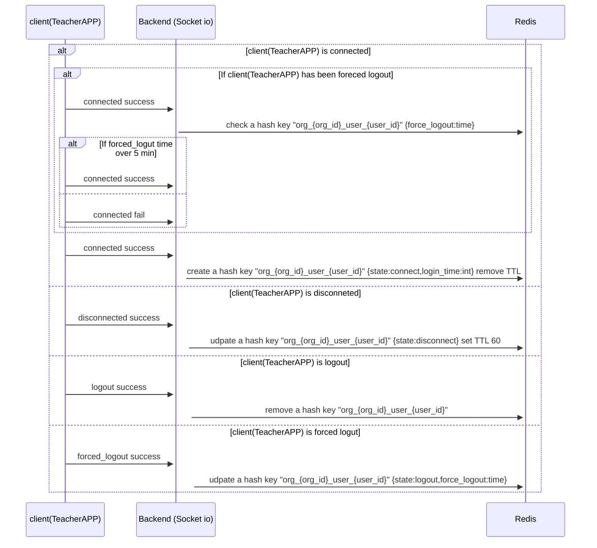

```mermaid
sequenceDiagram

    alt client(TeacherAPP) is connected
         alt If client(TeacherAPP) has been foreced logout
            client(TeacherAPP)->>+Backend (Socket io): connected success
            Backend (Socket io)->>+Redis: check a hash key "org_{org_id}_user_{user_id}" {force_logout:time}
            alt If forced_logut time over 5 min
                client(TeacherAPP)->>+Backend (Socket io): connected success
            else
                client(TeacherAPP)->>+Backend (Socket io): connected fail
            end

        end
        client(TeacherAPP)->>+Backend (Socket io): connected success
        Backend (Socket io)->>+Redis: create a hash key "org_{org_id}_user_{user_id}" {state:connect,login_time:int} remove TTL

    else client(TeacherAPP) is disconneted
        client(TeacherAPP)->>+Backend (Socket io): disconnected success
        Backend (Socket io)->>+Redis: udpate a hash key "org_{org_id}_user_{user_id}" {state:disconnect} set TTL 60

    else client(TeacherAPP) is logout
        client(TeacherAPP)->>+Backend (Socket io): logout success
        Backend (Socket io)->>+Redis: remove a hash key "org_{org_id}_user_{user_id}"

    else client(TeacherAPP) is forced logut
        client(TeacherAPP)->>+Backend (Socket io): forced_logout success
        Backend (Socket io)->>+Redis: udpate a hash key "org_{org_id}_user_{user_id}" {state:logout,force_logout:time}

    end


```
