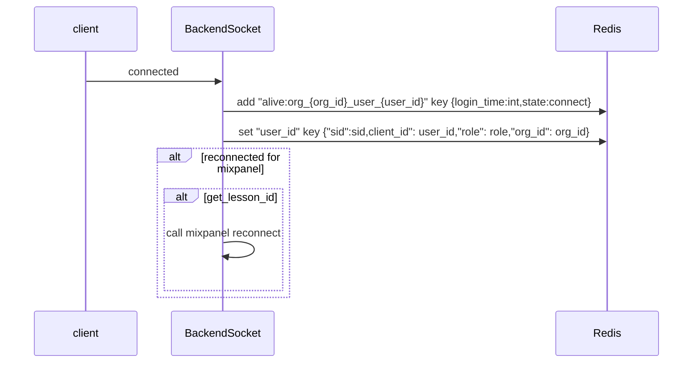
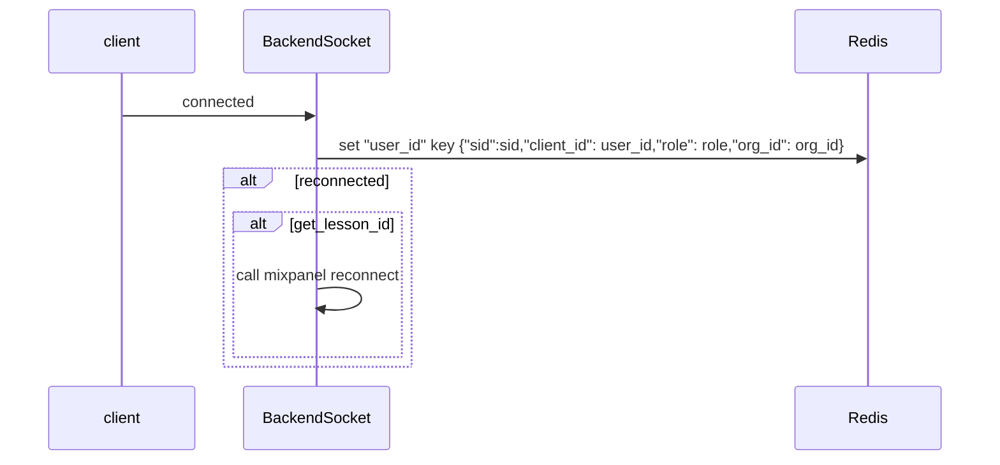
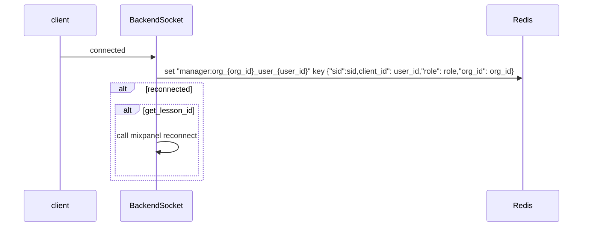
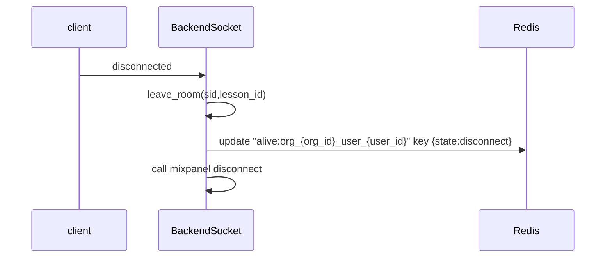
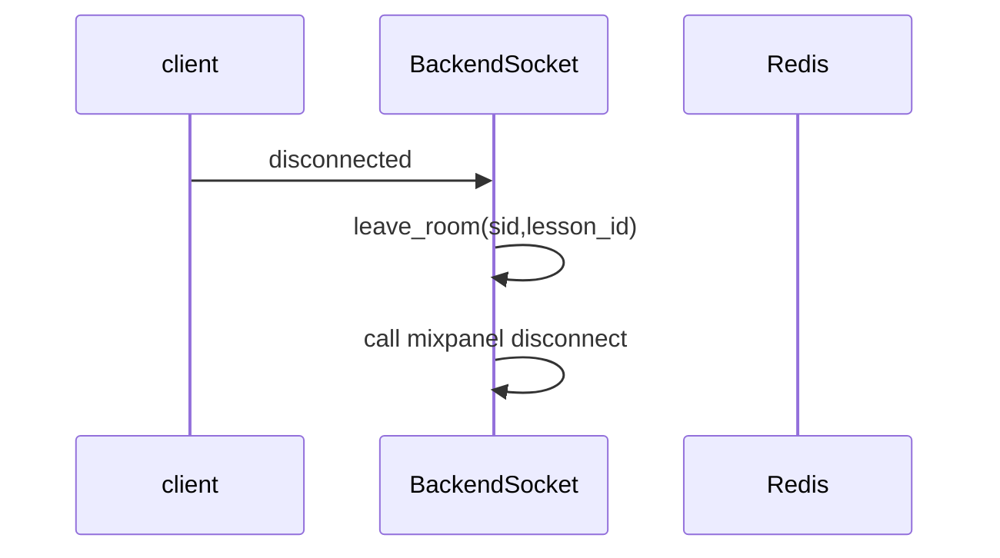
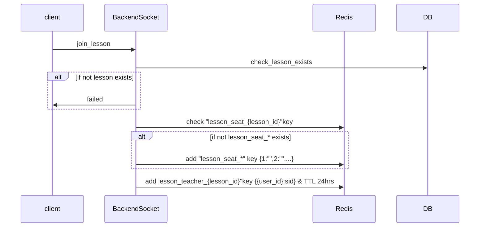
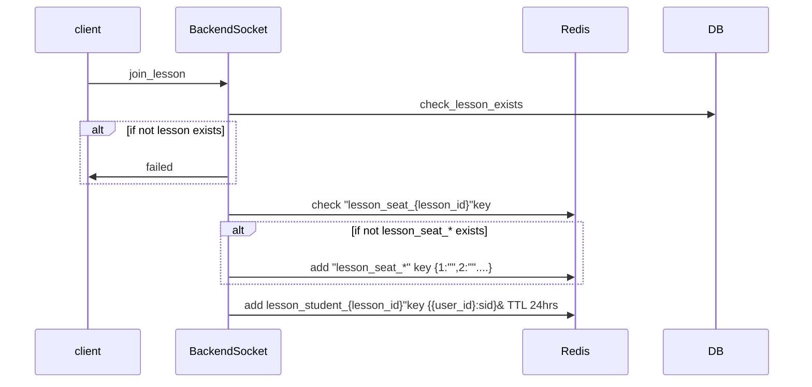
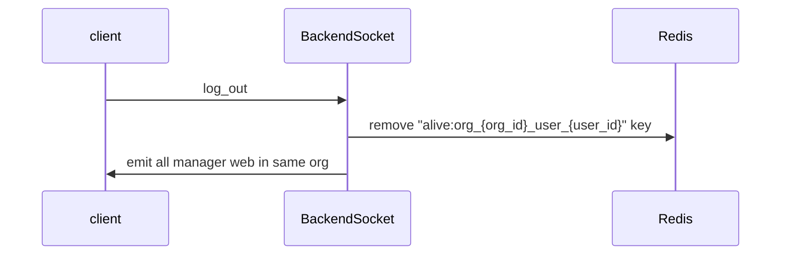

- # connect Event

  - ### queryString:

        role=teacher/student
        org_id={org_id}
        product_type= manager (optional)(manager_web need)
        auth=access_token

  - ## TeacherAPP

- ## StudentWeb

- ## ManagerWeb

---

- # disconnect Event

  - ### queryString:
        role=teacher/student
        org_id={org_id}
        product_type= manager (optional)(manager_web need)
        auth=access_token

- ## TeacherAPP

- ## StudentWeb/ ManagerWeb

- # join_lesson Event

  - ### data:

         {
            user_id:"",
            lesson_id:"",
            role:teacher/student
         }

- ## TeacherAPP

- ## StudentWeb

- # log_out Event

  - ### data:

         {
            user_id:"",
            org_id:"",
         }

- ## TeacherAPP

