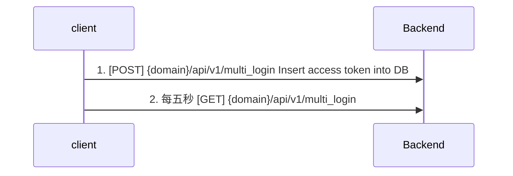
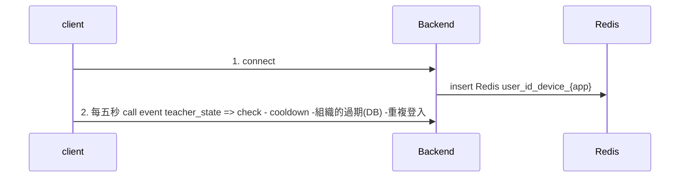

目前 multi login

```
需求：防止相同帳號在不同裝置登入
```


```mermaid
          sequenceDiagram

            participant C as client
            participant B as Backend


            C->>B: 1. [POST] {domain}/api/v1/multi_login Insert access token into DB
            C->>B: 2.  每五秒 [GET] {domain}/api/v1/multi_login

```

New API multi log

```
- 需求：需要即時確認teacher app 能否使用
 ex 被迫登出cooldown / multi_login 防止相同帳號在不同裝置登入/方案是否過期
```


```mermaid
          sequenceDiagram

            participant C as client
            participant B as Backend
            participant R as Redis


            C->>B: 1. connect
            B->>R: insert Redis  user_id_device_{app}
            C->>B: 2.  每五秒 call event teacher_state => check - cooldown  -組織的過期(DB) -重複登入

```
