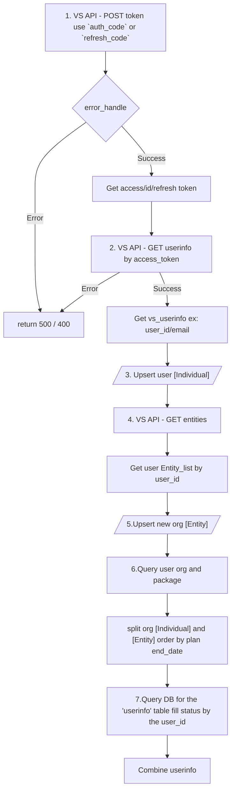

### Login function

```mermaid

graph TD
    A[1. VS API - POST token use `auth_code` or `refresh_code`] --> B{error_handle}
    B -->|Error| C["return /400500"]
    B -->|Success| D[Get access/id/refresh token]
    D --> F[2. VS API - GET userinfo by access_token]
    F -->|Error| C[return 500 / 400]
    F -->|Success| G[Get vs_userinfo ex: user_id/email]
    G --> H[/"3. Upsert user [Individual] "/]
    H -->J[4. VS API - GET entities]
    J --> U[Get user Entity_list by user_id]
    U --> L[/"5.Upsert new org [Entity]"/]
    L -->  K[6.Query user org and package]
    K-->  M["split org [Individual] and [Entity] order by plan end_date"]
    M --> N[7.Query DB for the 'userinfo' table fill status by the user_id]
    N --> O[Combine userinfo]


```

