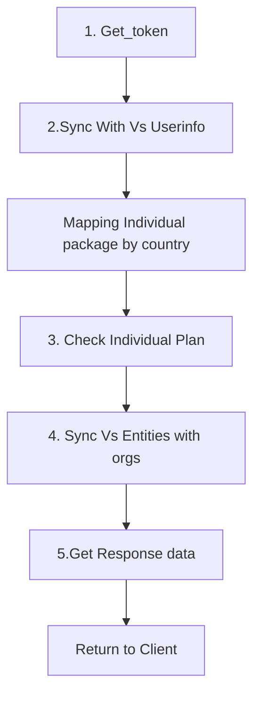
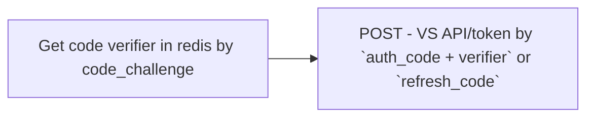
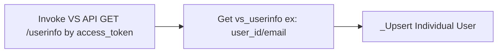
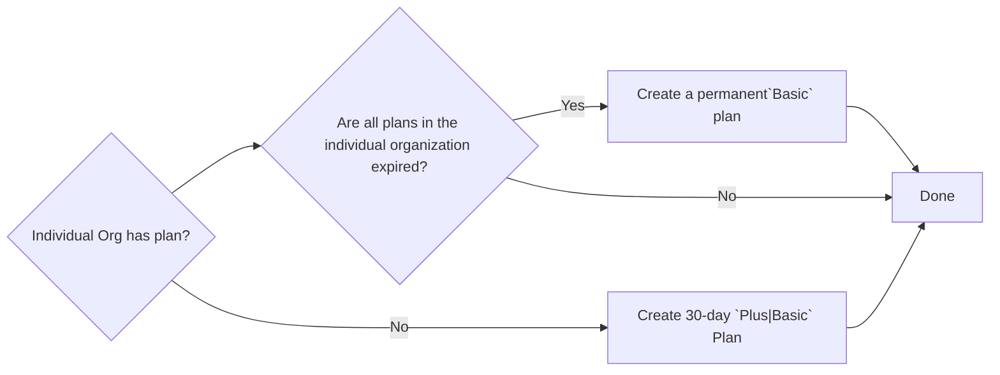
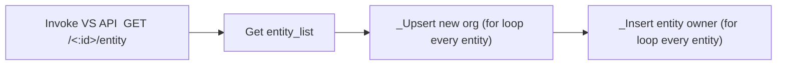
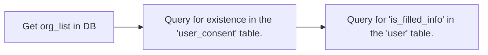
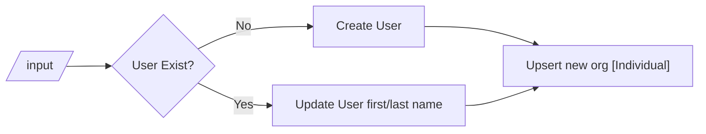
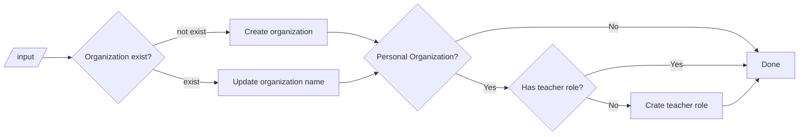
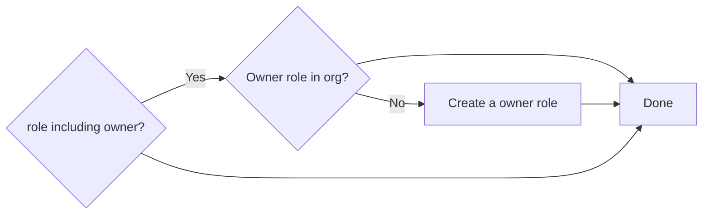

### Login function



### 1. Get_token



### 2. Sync With Vs Userinfo



### 3. Check Individual Plan

- 個人組織未曾有過 plan,會根據國家給予 30 天的 Plus or Basic Plan
- 如果個人組織已經有存在 plan 則會確定所有方案是否過期,過期則會補一個 Permanent `Basic` Plan



### 4. Sync Vs Entities with orgs



### 5.Get Response data



### \_Upsert Individual User



### \_Upsert new org[Individual/Entity]

```
- Entity:  org_id=entity_id
- Individual: org_id=user_id(normal)/is_individual=True
```



### \_Insert entity owner



### Request body

- auth_code+code_challenge or refresh_token 二擇一

  - auth_code+code_challenge:

  ```
    {
      "code": "string",
      "code_challenge":"",
      "redirect_uri":"",
      "client": "string" APP|WEB,
      }
  ```

  - refresh_token:

  ```
   {
     "refresh_token":"",
     "redirect_uri":"",
     "client": "string" APP|WEB,
   }
  ```

### Response

```
{
    "data": {
        "user_id": "str",
        "email": "str",
        "first_name": "str",
        "last_name": "str",
        "organizations": [
            {
                "user_display_name":"",
                "org_id": "",
                "package": "",
                "org_name": "",
                "roles": [
                    "teacher"
                ],
                "package_code": 1,
                "end_date": int|null,
                "student_concurrent":int
            },
        ],
        "individual": {
           "user_display_name": "str",
           "org_id": "str",
           "package": "str",
           "org_name": "Individual",
           "roles": [
                "teacher"
             ],
           "package_code": int,
           "end_date": int/null,
           "student_concurrent":int
        },
        "id_token": "",
        "access_token:"",
        "refresh_token":"",
        "is_filled_info":bool
        "is_consent":bool,
        "country:"",
    }
}
```
