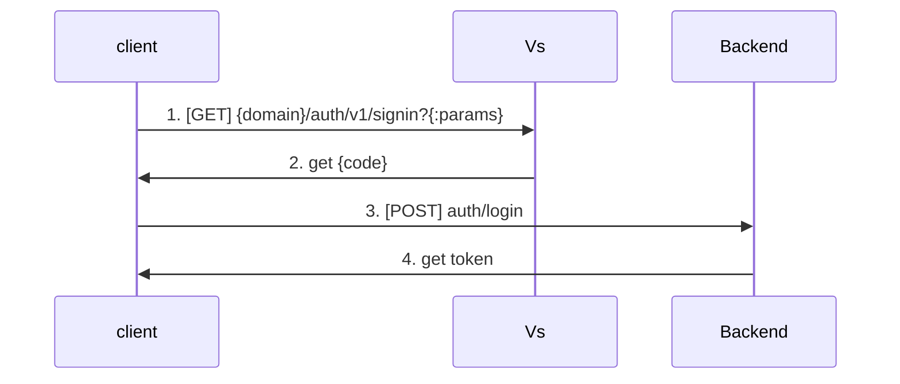

```mermaid
          sequenceDiagram

            participant C as client
            participant V as Vs
            participant B as Backend


            C->>V: 1. [GET] {domain}/auth/v1/signin?{:params}
            V->>C:2. get {code}
            C->>B:3.  [POST] auth/login 
            B->>C:4. get token 
```
