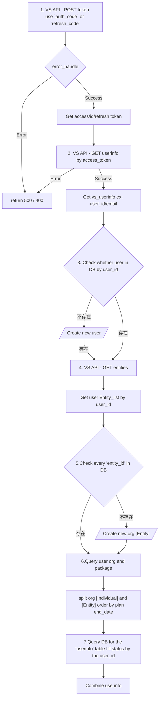
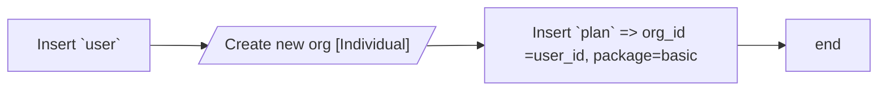
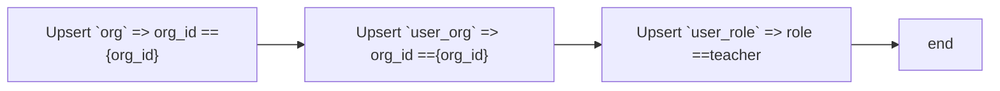

### Login


```mermaid

graph TD
    A[1. VS API - POST token use `auth_code` or `refresh_code`] --> B{error_handle}
    B -->|Error| C["return /400500"]
    B -->|Success| D[Get access/id/refresh token]
    D --> F[2. VS API - GET userinfo by access_token]
    F -->|Error| C[return 500 / 400]
    F -->|Success| G[Get vs_userinfo ex: user_id/email]
    G --> H{3. Check whether user in DB by user_id}
    H -->|不存在|I[/"Create new user "/]
    I -->|存在|J[4. VS API - GET entities]
    H -->|存在|J
    J --> U[Get user Entity_list by user_id]
    U --> L{"5.Check every 'entity_id' in DB "}
    L -->|不存在|P[/"Create new org [Entity]"/]
    L -->|存在|K
    P -->  K[6.Query user org and package]
    K-->  M["split org [Individual] and [Entity] order by plan end_date"]
    M --> N[7.Query DB for the 'userinfo' table fill status by the user_id]
    N --> O[Combine userinfo]


```

### Create new user [Individual]


```mermaid

graph LR

    B[Insert `user`] --> C[/"Create new org [Individual]"/]
    C --> D[Insert `plan` => org_id =user_id, package=basic ]
    D --> E[end]


```

### Create new org[Individual/Entity]

```
- Entity:  org_id=entity_id
- Individual: org_id=user_id
```


```mermaid

graph LR
    C["Upsert `org` => org_id =={org_id}"]
    C --> D["Upsert `user_org` => org_id =={org_id}"]
    D --> E[Upsert `user_role` => role ==teacher]
    E --> G[end]


```
