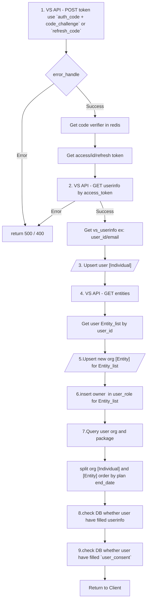
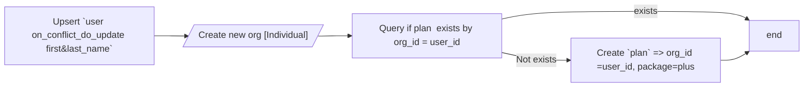
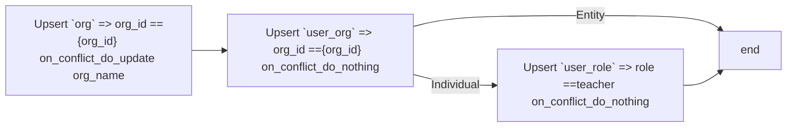

### Login function


```mermaid

graph TD
    A[1. VS API - POST token use `auth_code + code_challenge` or `refresh_code`] --> B{error_handle}
    B -->|Error| C["return 500 / 400"]
    B -->|Success| Z[Get code verifier in redis]
    Z--> D[Get access/id/refresh token]
    D --> F[2. VS API - GET userinfo by access_token]
    F -->|Error| C[return 500 / 400]
    F -->|Success| G[Get vs_userinfo ex: user_id/email]
    G --> H[/"3. Upsert user [Individual] "/]
    H -->J[4. VS API - GET entities]
    J --> U[Get user Entity_list by user_id]
    U --> L[/"5.Upsert new org [Entity]" for Entity_list/]
    L --> Q["6.insert owner  in user_role for Entity_list"]
    Q -->  K[7.Query user org and package]
    K-->  M["split org [Individual] and [Entity] order by plan end_date"]
    M --> N[8.check DB whether user have filled userinfo ]
    N --> R[9.check DB whether user have filled `user_consent`]
    R --> O[Return to Client]


```

### Upsert new user [Individual]


```mermaid

graph LR

    B[Upsert `user on_conflict_do_update first&last_name`] --> C[/"Create new org [Individual]"/]
    C --> D[Query if plan  exists by org_id = user_id ]
    D -->|Not exists|E[Create `plan` => org_id =user_id, package=plus ]
    D -->|exists|G[end]
    E --> G


```

### Upsert new org[Individual/Entity]

```
- Entity:  org_id=entity_id
- Individual: org_id=user_id
```


```mermaid

graph LR
    C["Upsert `org` => org_id =={org_id} on_conflict_do_update org_name"]
    C --> D["Upsert `user_org` => org_id =={org_id}  on_conflict_do_nothing" ]
    D --> |Individual|E[Upsert `user_role` => role ==teacher on_conflict_do_nothing]
    D --> |Entity|G[end]
    E --> G[end]


```
