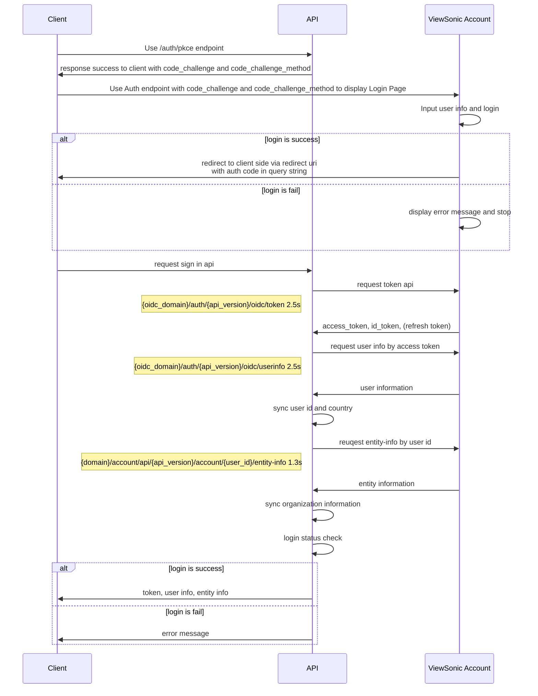

```mermaid
sequenceDiagram
    participant client as Client
    participant api as API
    participant vsa as ViewSonic Account
    
    client ->> api: Use /auth/pkce endpoint
    api ->> client: response success to client with code_challenge and code_challenge_method
    client ->> vsa : Use Auth endpoint with code_challenge and code_challenge_method to display Login Page
    vsa ->> vsa : Input user info and login
    alt login is success
        vsa ->> client : redirect to client side via redirect uri <br/> with auth code in query string        
    else login is fail
        vsa ->> vsa : display error message and stop
    end
    client ->> api : request sign in api
    api ->> vsa : request token api
    note left of api : {oidc_domain}/auth/{api_version}/oidc/token 2.5s
    vsa ->> api : access_token, id_token, (refresh token)
    api ->> vsa : request user info by access token
    note left of api : {oidc_domain}/auth/{api_version}/oidc/userinfo 2.5s
    vsa ->> api : user information
    api ->> api : sync user id and country
    api ->> vsa : reuqest entity-info by user id
    note left of api : {domain}/account/api/{api_version}/account/{user_id}/entity-info 1.3s
    vsa ->> api : entity information
    api ->> api : sync organization information
    api ->> api : login status check
    alt login is success
        api ->> client : token, user info, entity info
    else login is fail
        api ->> client : error message
    end
```