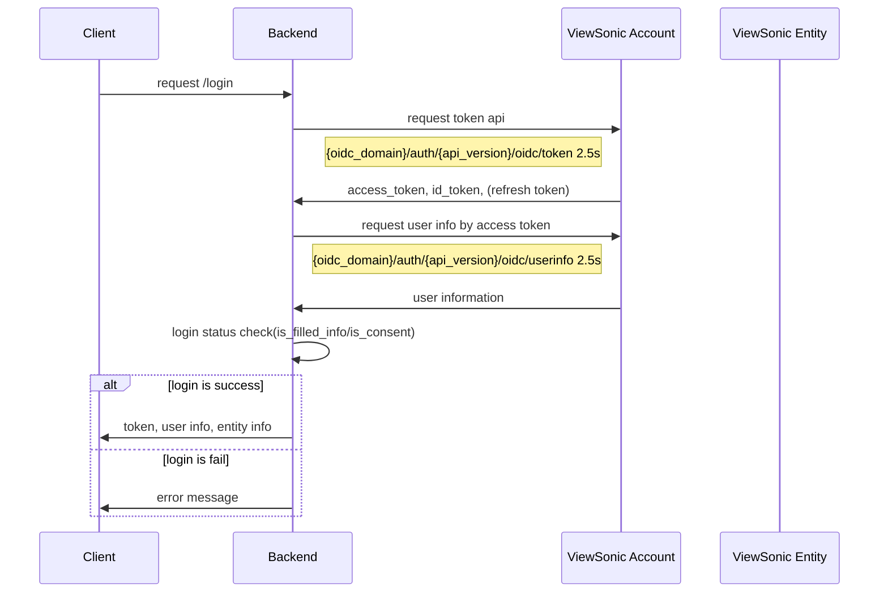
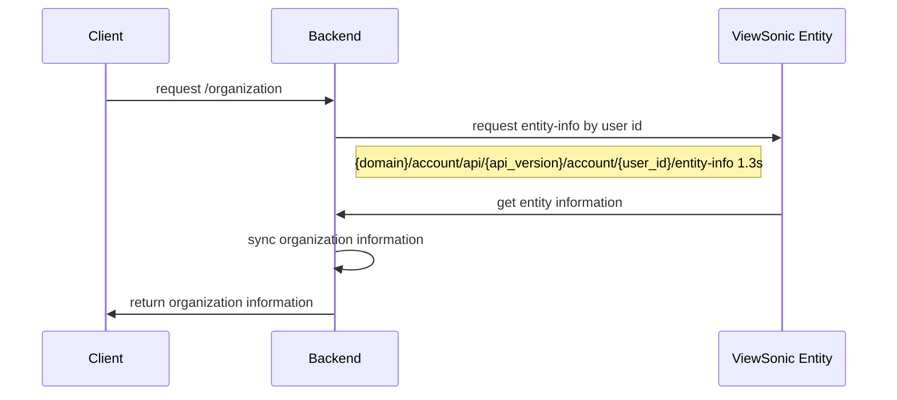

# /vs/auth/login



### Request body

- 兩種形式的 body :

  - auth_code+code_challenge:

  ```
    {
      "code": "string",
      "code_challenge":"",
      "redirect_uri":"",
      "client": "string" APP|WEB,
      }
  ```

  - refresh_token:

  ```
   {
     "refresh_token":"",
     "redirect_uri":"",
     "client": "string" APP|WEB,
   }
  ```

### Response

    {
    "data": {
        "user_id": "str",
        "email": "str",
        "first_name": "str",
        "last_name": "str",
        "id_token": "",
        "access_token":"",
        "refresh_token":"",
        "is_filled_info":bool
        "is_consent":bool,
        "country:"",
    }
    }

### 商業邏輯：

    invoke VS API get token + VS API  get userinfo
    Upsert user_id in user table
    Return token/userinfo/is_counsent/is_filled_info

# POST /vs/organization



### Request

    headers:
    - access_token
    - country

### Response

```

{
  "entity":[
            {
                "user_display_name":"",
                "org_id": "",
                "package": "",
                "org_name": "",
                "package_code": int,
                "role":["owner","teacher"],
                "end_date": int|null,
                "student_concurrent":int
            },{...},
          ],
 "individual":{
            "user_display_name": "str",
            "org_id": "str",
            "package": "str",
            "org_name": "Individual",
            "package_code": int,
            "role":["owner","teacher"],
            "end_date": int/null,
            "student_concurrent":int,
        },
}
```

### 商業邏輯：

    Invoke VS API entity-info
    Upsert organization/user_org/user_role/package/plan tables
    Return organization info
